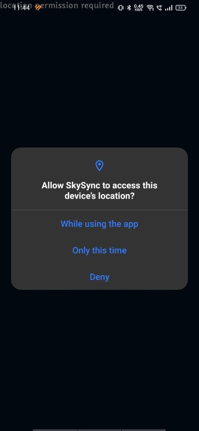
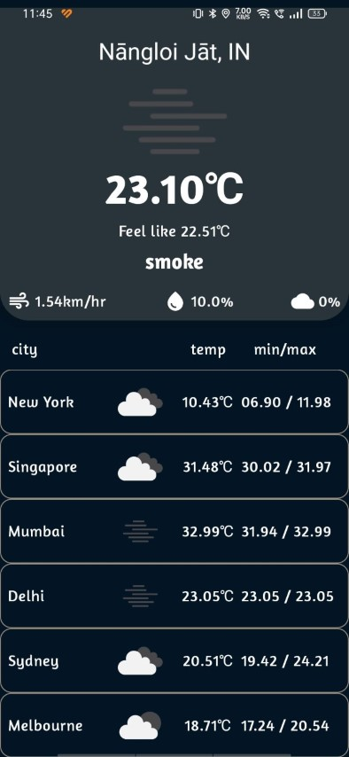

# SkySync

The purpose of this assignment is to create a simple App to display the current weather forecast
using the OpenWeatherMap free weather API.

| | |  |
|---|---|---|

[Download apk](./media/app-debug.apk)
